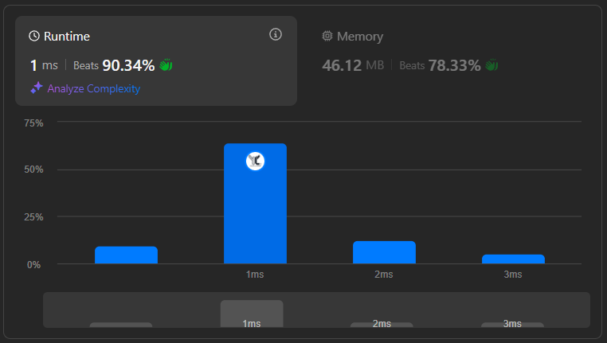

# Problem 12 : Intersection of Two Arrays ([Intersection of Two Arrays LeetCode](https://leetcode.com/problems/intersection-of-two-arrays/description/))

Given two integer arrays nums1 and nums2, return an array of their intersection. 

Each element in the result must be unique and you may return the result in any order.

## Rank and Runtime/Memory Statistics :  

## Example : 

    Input: nums1 = [2, 3, 5, 7] and nums2 = [2, 3, 6]
    Output: intersection = [2, 3] 
