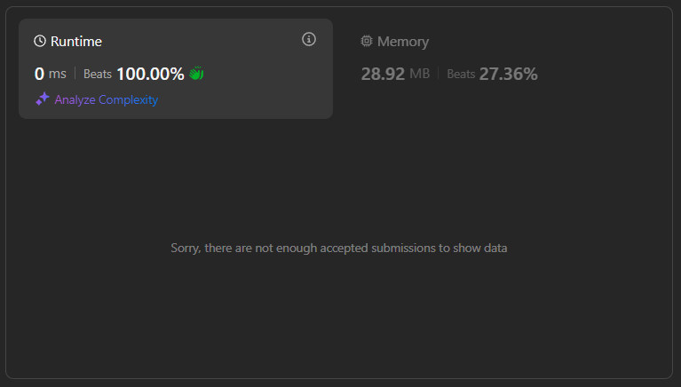

# Problem 11 : Power Of Four ([Power of Four LeetCode](https://leetcode.com/problems/power-of-four/description/))

Given an integer n, return true if it is a power of four. Otherwise, return false.

An integer n is a power of four, if there exists an integer x such that n == 4x.

By using the Natural Logarithm : 

## Rank and Runtime/Memory Statistics :  

## Example1 : 

    Input: n = 16
    Output: 16 is a power of 4, because 16 = 4^x and x=2 and x is an integer   

## Example2 : 

    Input: n = 12
    Output: 12 is not a power of 4, because 12 = 2^x, and x=1.79 but x is not an Integer    
