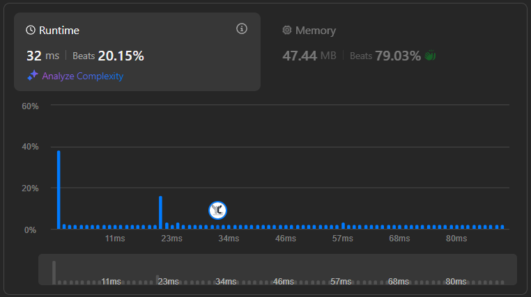

# Exercice 1 : Two Sum ([TwoSum LeetCode](https://leetcode.com/problems/two-sum/description/))

Given an array of integers nums and an integer target, return indices of the two numbers such that they add up to target.

You may assume that each input would have exactly one solution, and you may not use the same element twice.

## Rank and Runtime/Memory Statistics :  

## Example : 

    Input: nums = {1, 2, 3, 6} and target = 5 
    Output: indexTab = {1, 2} because nums[1] + nums[2] = target 
